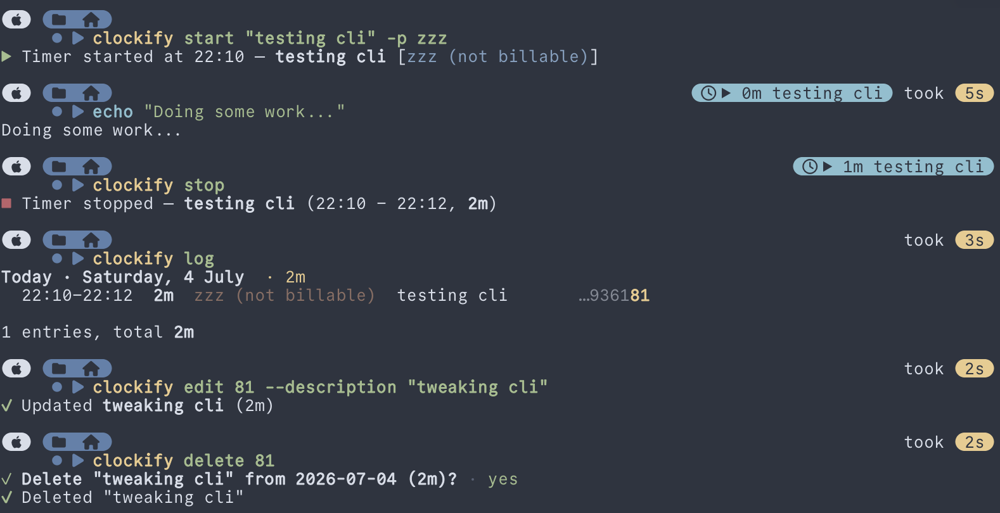

# Clockify CLI

A fast, pretty, terminal-native client for [Clockify](https://clockify.me) time tracking.
One binary, one config file, zero bundled Chromiums.



## What you get

- A complete CLI: start, stop, and discard timers, add and edit entries, browse
  logs, projects, tasks, and workspaces, and get per-project reports with bar charts
- A full TUI (just run `clockify` with no arguments) with themes — Nord, Dracula,
  Gruvbox, or your terminal's own palette
- jj-style short entry references: type the highlighted few characters instead of a
  24-character MongoDB ObjectId, because life is short and hex is long
- 1Password integration: keep the API key in your vault, store only a secret
  reference on disk
- A starship prompt module with a local cache, so your prompt renders in
  milliseconds instead of doing an API round-trip per keystroke
- Colors everywhere, taken from your actual Clockify project colors

## Install

Homebrew (macOS and Linux):

```sh
brew tap bananajam/tap
brew install clockify-cli
```

Or from source:

```sh
cargo install --path .   # requires Rust 1.85+ (edition 2024)
```

Either way the binary is called `clockify`.

This is an unofficial client and is not affiliated with or endorsed by
Clockify or CAKE.com — it just speaks their public API, politely.

## Setup

```sh
clockify auth
```

An interactive wizard walks you through it: it tells you where to generate an API
key (Clockify → Profile Settings → API), validates the key against the API, and lets
you pick a default workspace.

You can paste the key directly, or — if you use 1Password — point the wizard at a
secret reference like `op://Vault/Clockify API Key/credential` (quotes included is
fine; that's how `op` copies them). With a reference, the key itself never touches
disk: it's fetched through the `op` CLI at runtime.

Precedence when resolving the key: the `CLOCKIFY_API_KEY` environment variable,
then the 1Password reference, then the plaintext key in the config file.

Check where you stand at any time:

```sh
clockify auth status
```

## Daily use

```sh
clockify start "fixing the parser" -p backend     # start a timer
clockify status                                   # what's running, live elapsed
clockify stop                                     # stop it
clockify discard                                  # stop it and pretend it never happened
clockify add "standup" --from 09:30 --to 09:45 -p backend
clockify log --week                               # entries grouped by day, with totals
clockify report --month                           # hours per project, with bars
clockify submit -y                                # submit this month's time for approval
clockify submit --week                            # submit this week's time for approval
clockify edit 41d7 --to 17:30                     # edit by short id suffix
clockify edit @ -p backend                        # @ is the running timer
clockify delete 41d7                              # delete (asks first; -y skips)
clockify projects                                 # grouped by client
clockify projects default backend                 # default project for new entries
clockify workspaces switch <name>                 # change workspace
```

Projects and tasks are matched by name — case-insensitive, substring is enough,
ambiguity gets you a helpful list. Times accept `HH:MM`, `yesterday 17:00`,
`YYYY-MM-DD HH:MM`, or full RFC 3339, all interpreted in your local timezone.

Set a default project once (`clockify projects default backend`) and `start` and
`add` will use it whenever you don't pass `--project` — pass `--no-project` for
the rare entry that genuinely belongs to nothing. The default is remembered per
workspace, and the TUI forms pre-select it too. Started the timer on the wrong
project anyway? `clockify edit @ -p <project>` fixes the running timer in place —
`@` always means "the running timer", jj-style.

### Submitting approvals

`clockify submit` creates a Clockify approval request for your time entries. It
defaults to the current month, because many workspaces approve monthly:

```sh
clockify submit                  # preview and confirm this month
clockify submit -y               # submit this month without prompting
clockify submit --week           # submit the current Monday–Sunday week
clockify submit --resubmit       # resubmit rejected/withdrawn time
clockify submit --from 2026-07-01 --period monthly
```

The command refuses to submit an empty period or a period with a running timer.
Clockify now handles time and expenses separately; this CLI submits time entries
only, and does not create expense approval requests.

### Short entry ids

Clockify entry ids are MongoDB ObjectIds: the first bytes are a timestamp, so
entries created around the same time all share a prefix — the unique part is the
tail. `clockify log` therefore shows the last characters of each id and highlights
the shortest suffix that uniquely identifies the entry among your last 90 days.
Type just the highlighted part into `edit` or `delete`. If a suffix ever becomes
ambiguous, you get the list of candidates instead of a wrong guess — the CLI never
acts on an ambiguous reference.

## The TUI

Run `clockify` with no arguments.

```
Log · Report · Projects · Workspaces
```

| Key | Action |
| --- | --- |
| `Tab` / `1`–`4` | switch view |
| `j` / `k` | move selection |
| `h` / `l` | previous / next week |
| `s` | start a timer (form) |
| `x` / `X` | stop / discard the running timer |
| `a` / `e` / `d` | add / edit / delete an entry |
| `m` / `w` | month / week report period (in Report) |
| `S` / `R` | submit / resubmit the report period (in Report) |
| `Enter` | switch workspace (in Workspaces) |
| `t` | cycle theme |
| `r` | refresh |
| `q` | quit |

The header shows the running timer with live elapsed time. Data loads in the
background — the UI opens immediately, weeks you've already visited switch
instantly from cache, and anything you change is refetched quietly.

Themes: `nord` (default, obviously the correct choice), `dracula`, `gruvbox`, and
`terminal` for terminals without truecolor. The choice persists in the config.

## Starship prompt

`clockify status --short` prints a single compact line (`▶ 1h23m fixing the parser`)
and nothing when idle. It's served from a small cache (`~/.cache/clockify/`), so it
costs about 13 ms — your own starts and stops invalidate the cache instantly, and
changes made elsewhere show up within two minutes.

```toml
# ~/.config/starship.toml
command_timeout = 2000

[custom.clockify]
style = 'teal'
format = '[$output]($style) '
command = 'clockify status --short'
when = 'test -n "$(clockify status --short)"'
shell = ['sh']
```

Add `${custom.clockify}` to your `format` string if you use an explicit one.

## Agents

Coding agents are people too, or at least they parse JSON. Every command takes a
`--json` flag for machine-readable output with a stable shape, `delete` and
`discard` take `-y` to skip the confirmation prompt, and running `clockify`
without a terminal prints usage instead of attempting to draw a TUI at a very
confused subprocess.

If you use Claude Code or Codex, the CLI ships its own skill — a short
instruction file that teaches the agent the commands, the `@` reference, and
the JSON shapes. It's the same SKILL.md format either way; only the mailbox
differs:

```sh
clockify skill install            # installs for every agent found on this machine
clockify skill install --codex    # or pick: --claude, --codex
clockify skill install --project  # into the current repo instead of user-level
clockify skill show               # read it first, it's short
```

Claude Code reads it from `~/.claude/skills/`, Codex from `~/.codex/skills/`
(or `.agents/skills/` inside a repo). After that, saying "start a timer for
code review" to your agent of choice just works.

## Files

| Path | What |
| --- | --- |
| `~/.config/clockify/config.toml` | API key (or 1Password reference), workspace, theme. Written with `0600` permissions. |
| `~/.cache/clockify/status.json` | Prompt status cache. Safe to delete at any time. |

Both honor `XDG_CONFIG_HOME` / `XDG_CACHE_HOME`.

## Development

```sh
cargo build
cargo test
cargo clippy --all-targets -- -D warnings
```

No frameworks were harmed in the making of this tool. Total dependency count is a
number you can actually read out loud, and `cargo build` finishes before your
coffee does — which is more than can be said for `npm install`.
